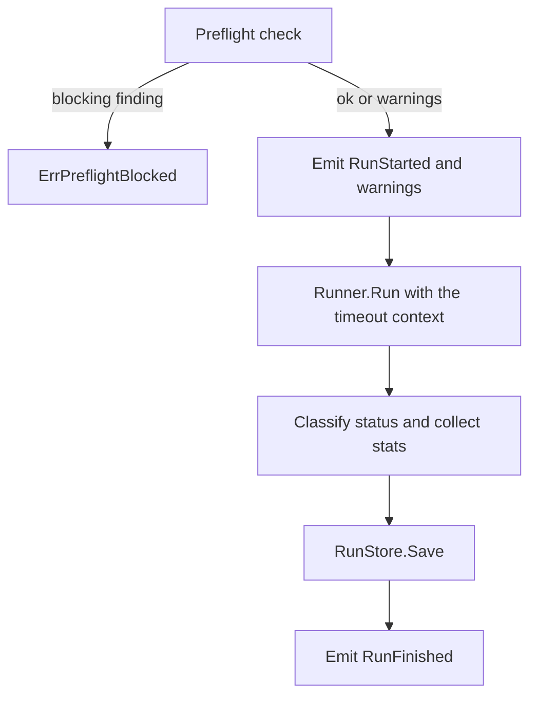

<!-- memoria:section id="overview" files="run.go run_event.go preflight.go" -->
# Domain

<!-- memoria:export id="summary" -->
The domain package holds uagent's core model: run requests and results, normalized run events, statistics, and the run service with its ports. It depends only on the Go standard library and uuid.
<!-- /memoria:export -->

1. [Model](#model)
2. [Run a task](#run-a-task)
3. [Statistics](#statistics)
4. [Contract](#contract)
5. [Tests](#tests)

The domain knows nothing about processes, files, or JSON. Adapters implement its ports:

| Port | Implemented by | Job |
| --- | --- | --- |
| `Preflight` | `preflight` | Inspect the environment before a run and return findings |
| `Runner` | `runner` | Execute a request and emit events while it runs |
| `RunStore` | `runstore` | Persist a finished run |
| `EventSink` | `stream`, `render`, `StatsCollector` | Receive events as they happen |

## Model

A `RunRequest` carries the prompt, provider, model, effort, workspace, timeout, and the other runner options.
A `RunResult` carries the request, a `Status`, the runner exit code, the wall time, the `Stats`, and the answer.

Events describe a run in order: `RunStarted`, `PreflightWarning`, `TurnStarted`, `ModelResponded`, `ToolCalled`, `ToolStarted`, `ToolFinished`, `AssistantMessage`, `ReasoningSummary`, `RunnerError`, and `RunFinished`.
Each event is a plain struct with an `At` time. The `stream` README describes their wire form.
<!-- /memoria:section -->

<!-- memoria:section id="usage" files="run_service.go" -->
## Run a task

`NewRunService(preflight, runner, store)` returns a `RunService`. `Run(ctx, req, sink)` does four things in order:

1. It runs preflight. Any blocking finding returns `ErrPreflightBlocked` with every blocking message. `RunRequest.AllowDotenv` downgrades the `dotenv_risky` finding to a warning.
2. It fills in a missing session ID (a new UUID) and run ID (`YYYYMMDD-HHMMSS-<first 8 characters of the session ID>`).
3. It runs the runner under a context that ends at `RunRequest.Timeout`. Every event goes to both the stats collector and the sink.
4. It classifies the outcome, saves the result, and emits `RunFinished`. `RunFinished` is emitted even when saving fails; the save error is still returned.
<!-- /memoria:section -->

<!-- memoria:section id="statistics" files="stats.go" -->
## Statistics

`StatsCollector` folds events into `Stats`. It also works as an `EventSink`, so saved event files can be re-summarized.

- Model time is the union of intervals from each `TurnStarted` to its `ModelResponded`.
- Tool busy time is the union of intervals from each `ToolStarted` to its `ToolFinished`, keyed by operation ID.
- Tool/model overlap is the intersection of those two unions.
- Max parallel tools is the most operations running at once. A tool that ends exactly when another starts does not count as parallel.
- A tool call fails when any `ToolFinished` for it has `OK` false.
- `Close(at)` counts turns and tools that never finished (after a kill) up to `at`.

`Answer()` returns the final answer, or the last assistant text when the run produced no final answer.
<!-- /memoria:section -->

<!-- memoria:section id="contract" files="run_service.go run.go" -->
## Contract

`Run` returns an error only when the run could not start or could not be saved. A run that started and failed is a result with a status:

| Status | When |
| --- | --- |
| `ok` | The runner exited 0 and reported no error or model failure |
| `error` | The runner exited non-zero, reported an error, or a response carried a failure |
| `timeout` | `RunRequest.Timeout` expired and the runner was killed |
| `interrupted` | The caller's context ended (for example Ctrl-C) and the runner was killed |
| `disk_limit` | The runner adapter killed the run because tool output grew too large |

The runner must stop the whole process tree when its context ends, and must report why it stopped through `RunnerExit.Termination`.
Sinks receive events from one goroutine at a time.
<!-- /memoria:section -->

<!-- memoria:section id="testing" files="run_service_test.go stats_test.go" -->
## Tests

`run_service_test.go` uses a test harness with generated mocks for `Preflight`, `Runner`, and `RunStore`, and a recording sink.
It covers blocking and downgraded findings, every status, timeout and interrupt through context cancellation, event order, and error returns.
`stats_test.go` builds events with the fixtures package and checks each statistic, including overlap and unfinished work.
<!-- /memoria:section -->
